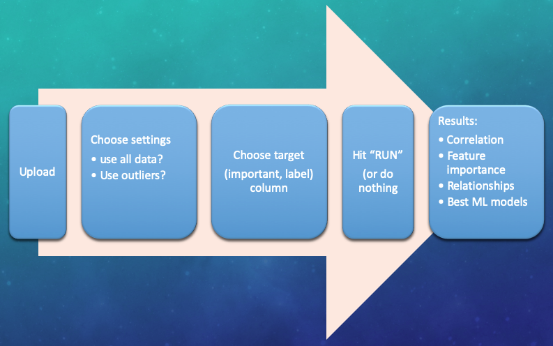
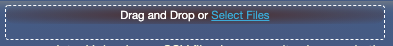
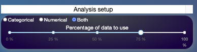
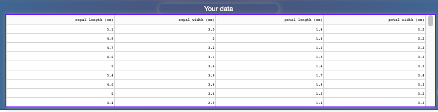
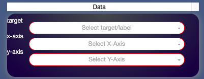
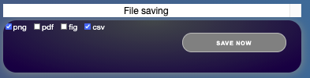
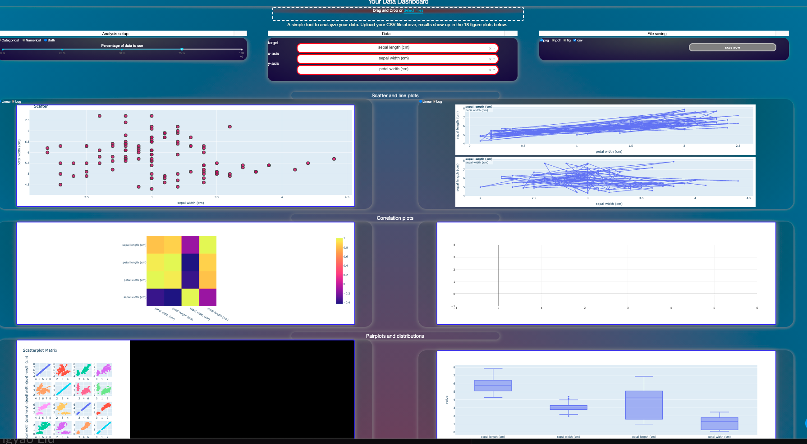

# Welcome all! 

## Welcome to my data dashboard.

# This is a simple tool specifically designed to help you with:
 
1. reducing effort
2. processing large datasets
3. and getting true validation.

Although there are several expensive and very complicated choices, most require 
some/basic training on how to even use them.

Accordingly, this tool is:

* a simple (just upload your data CSV) 
* cheap 
* low maintenance tool desinged for individuals and businesses. 
 
# Here is how it works, you:  

1. click a button to upload your data 
2. press on dials and move sliders to decide how to analyze it, such as: 
3. chooseing  your target (label) column, the feature you want to understand/improve 

That’s it. You get insight about your data, how the features relate to eachother,
to your most important feature and what ML tools are best for your data.

# Data analysis workflow 
 

## About the app 

The app is designed to be a simple webtool with four main user-input panels (listed below),
and 18 figure panels. The figures go from simple scatter plots to correlation heatmaps, 
to distribution displays, all the way tofast ML analysis to help direct future directions 
of data analysis. The main page should resemble the picture below when you just open it.
 

## Current status 

### You can now:  
 
* upload data and see at least 5 plots </li>
* dropdown boxes and data size slider work and you can see them changing plots 
 
## Due to intricacies of the analyis, these are left to do: 
 
1. plotting all figures, including ML comparisons and performances  
2. file-saving is currently not functional 
3. data cleaning/conversion pipelines need more work 

# Main panels 

1. Data-upload 
2. Analysis setup 
3. Plot axis choices dropdown 
4. File saving options 
5. Figure panels 
 
# Step-by-step guide 

## Upload your data by clicking or drag-and-dropping 
 

 
## Choose analysis settings 
 

 
## Your uploaded data should now be at the bottom of the page as a datatable, and it should look like this: 
 

 
## Pick target, x-axis and y-axis columns from the dropdown panel 

## Choose your file-saving preferences  

# That's all! You should see some results now and the page should look something like this ...  

 

 

Thank you for trying the tool. Please feel free to contact me for feedback and questions.

 

©  Last edit March 22, 2021. Mulugeta Semework Abebe
