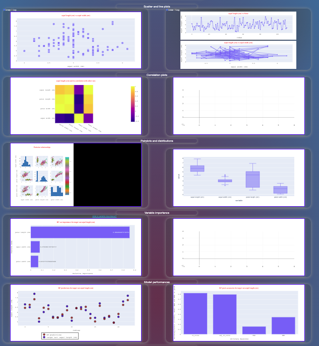

## Welcome all! Welcome to my data dashboard.
 
### This is a simple tool specifically designed to help you with:
 
1. reducing effort
2. processing large datasets
3. and getting true validation.

# Why this app? 
Although there are several expensive and very complicated choices, most require 
some/basic training on how to even use them. Accordingly, this tool is:

* a simple (just upload your data CSV) 
* cheap 
* low maintenance tool desinged for individuals and businesses. 
 
# Here is how it works, you:  

1. click a button to upload your data 
2. press on dials and move sliders to decide how to analyze it, such as: 
     * chooseing  your target (label) column
     * the feature you want to understand/improve 

That’s it. You get insight about your data, how the features relate to eachother,
to your most important feature and what ML tools are best for your data.

# Data analysis workflow 
 

## About the app 

The app is designed to be a simple webtool with four main user-input panels (listed below),
and 18 figure panels. The figures go from simple scatter plots to correlation heatmaps, 
to distribution displays, all the way tofast ML analysis to help direct future directions 
of data analysis. The main page should resemble the picture below when you just open it.
 

## Current status 

### You can now:  
 
* upload data and see 10 plots (as tested using just numeric data i.e. the Iris data provided here)
* the first few are simple data explorations, they are then followed by one RF analysis (showing variable importance for your target variable). RF   is shown in both bar graphs and wordcloud
* predictions of your target variable and associated accuracies are also provided in figures 9 & 10
* dropdown boxes and data size slider work,  and you can see them changing plots 
 
## Due to intricacies of the analyis, these are left to do: 
 
1. plotting all figures, including ML comparisons and performances  
2. file-saving is currently not functional 
3. data cleaning/conversion pipelines need more work (for instance categorical vs numeric data pipleline, as plotly is very picky about it)

# Main panels 

1. Data-upload 
2. Analysis setup 
3. Plot axis choices dropdown 
4. File saving options 
5. Figure panels 
 
# Step-by-step guide 

## Upload your data by clicking or drag-and-dropping 
 

 
## Choose analysis settings 
 

 
## Your uploaded data should now be at the bottom of the page as a datatable, and it should look like this: 
 

 
## Pick target, x-axis and y-axis columns from the dropdown panel

## Choose your file-saving preferences  

## That's all! 
The first three plots will fill up with all of the data, for visual surveillance. It may take a minute or two for graph updating 
 
## Once you choose your target and x and ys, you should see some results now - and the page should look something like this ...  
 

#### Please be patient and wait if you don't see all figures for the Iris data. Slowness is due to RF analysis. The RF regressor used not too stringent, to make sure decent time performance is achieved. * more information about RF and variable importance analysis is provided here: (https://github.com/semework/semework/blob/main/RF%20&%20variable%20importance.md)
 

#### Kindly get started by playing with the sample data provided (famous Iris data) ([here](https://github.com/semework/semework/tree/main/assets) ), which you can upload when you first run the app.

 

Thank you for trying the tool. Please feel free to contact me for feedback and questions.

 

©  Last edit March 26, 2021. Mulugeta Semework Abebe
